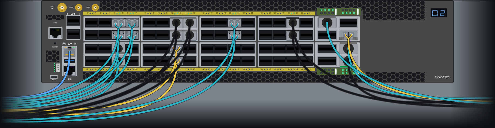
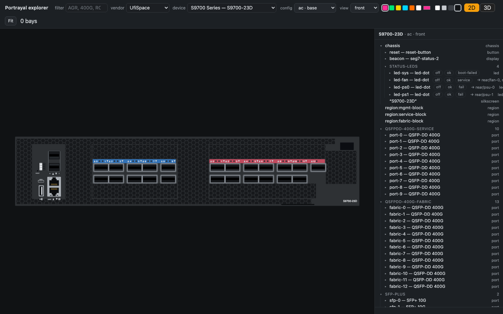
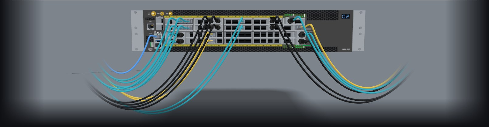

# Portrayal



Declarative, Git-versioned hardware device definitions, compiled into SVG where
every physical thing is individually addressable — ports, PSUs, fans, LEDs, bays,
regions.

A device is a YAML manifest that places reusable component contracts. The compiler
resolves it into one flat SVG in real millimetres, where every element carries a
stable DOM id and a data-path. That drawing can then be driven: colour a port from
telemetry, highlight a failed PSU, link a region to a ticket, export the whole thing
to a DCIM or a diagram tool.

The core is domain-neutral. Networking is the first profile, not the only one.



<p>
  <a href="https://portrayal.dev/media/hero-3d.mp4">
    
  </a>
  <br>
  <a href="https://portrayal.dev/media/hero-3d.mp4">▶ Watch it in 3D</a> - the same drawing, extruded, with the cables routed.
</p>

<p>
  <a href="https://www.rocnetsupply.com/">
    <picture>
      <source media="(prefers-color-scheme: dark)" srcset="docs/sponsor/RocNet-Primary-Logo-white.svg">
      
    </picture>
  </a>
  <br>
  Portrayal is sponsored by <a href="https://www.rocnetsupply.com/">RocNet Supply</a>.
</p>

```
spec/          schemas, compiler, linter, tests
library/       component contracts + skins, device manifests, NOS listings
kit/           @portrayal/kit: the JS consumer — draw, inspect, export
docs/          how the model works
```

The split is a line about who reads what. `spec/` and `library/` are the source
of truth and the compiler; they read YAML. `kit/` reads only what `build.sh`
publishes into `library/dist/`, which is a documented contract — so a consumer
needs the artifacts, not a checkout of this repository.

## Try it

```sh
python3 -m venv .venv && . .venv/bin/activate  # Python 3.12
python3 -m pip install -e ".[test]"            # the tools, and what the suite needs
./build.sh                                     # lint, then compile every device
./publish.sh --no-images                       # the same, plus the DCIM exports
python3 tools/serve.py 8931                    # then open http://localhost:8931/kit/index.html
```

`kit/index.html` is the explorer: every device in the build, any face, in 2D or
3D, with a tree you can click into. The 3D view loads three.js from unpkg.com, so
it needs internet access; the 2D view does not. `tools/serve.py` listens on this
machine only; set `PORTRAYAL_SERVE_HOST=0.0.0.0` to open it to the network. It is what the visual gate in
`docs/modelling-a-device.md` is run in. The raw compiled files are under
`http://localhost:8931/library/dist/` if you want them directly.

To compile one device:

```sh
python3 spec/tools/portrayal/render.py library/devices/edgecore/as7726-32x/device.yaml \
    --library library --out library/dist
```

The build and lint gates need Python 3.12 and `pip install -e .`, which brings
`pyyaml` and `jsonschema` and makes the `portrayal` package importable. The PNG
pictures `./publish.sh` renders beside the DCIM exports also need cairosvg:
`pip install -e ".[render]"`, which needs the system cairo library first
(`brew install cairo` on macOS, `apt install libcairo2` on Debian or Ubuntu),
or run `./publish.sh --no-images`. The build scripts are
**macOS and Linux only**: `build.sh` and `publish.sh` are shell scripts and run
one renderer per device under `xargs -P`. (`python -m portrayal lint|lock|test`
is pure Python and runs anywhere.) **Preparing a new vendor line** additionally needs
[docling](https://github.com/docling-project/docling) to convert vendor PDFs
into the figure-and-caption sets modelling works from:

```sh
pip install -e ".[intake]"                          # docling + pillow; GPU optional
python3 spec/tools/intake/extract.py <guide.pdf> --out working/images
```

The full intake process — what to hunt, where vendors keep it, staging rules,
and the conversion discipline that keeps docling from eating a machine — is
`.claude/skills/portrayal-vendor-intake/SKILL.md`. The modelling process that
follows it is `docs/modelling-a-device.md`.

## What makes it different

**Provenance is a first-class field, not a comment.** Every dimension records where
it came from and how confident that is — `datasheet`, `drawing`, `measured`,
`photo-measured`, `registry`, `borrowed`, `estimated`, and `known-wrong` for a value
carried only because nothing sourced can yet replace it. A device declares a `maturity` level and the linter
holds it to that standard: `verified` forbids an estimated value anywhere in the
assembly, including inside the components it places. So "is this model trustworthy"
is a question the tooling answers rather than a question you ask the author.

**A faceplate is modelled the way it is made** — punched, then printed, then
populated. Chassis silkscreen paints *under* the components that cover it, because
that is what happens to the real panel. `--without silkscreen` gives you the bare
panel-and-components drawing to hand to whoever does the artwork.

**Physical ids follow the silkscreen.** What the NOS calls an interface belongs
to the NOS vendor's listing of the box, because two operating systems on the
same hardware disagree and the hardware does not care.

**No vendor material is redistributed.** Facts are transcribed and cited; the
source documents stay out of the repository. See `PRIOR-ART.md`.

## Documentation

- `CONTRIBUTING.md` — how to add a device in an afternoon, and what a reviewer asks for
- `spec/DESIGN.md` — the architecture and the design decisions behind it
- `spec/DEPTH-AND-3D.md` — how depth and relief turn the 2D drawing into 3D
- `docs/layers-and-conformance.md` — the canonical manifest, the layer model and the maturity gate
- `docs/modelling-a-device.md` — how to model a device from reference material, stage by stage with a check at each; `docs/modelling-pitfalls.md` for when a figure or a rule misbehaves
- `docs/failure-by-omission.md` — the audit for tools that report success by reporting nothing, and the census-and-register method it produced
- `library/components/CATALOGUE.md` — every component on one page: size, what it conforms to,
  how many devices use it. Written by `./build.sh` in a checkout and not committed, so it is not on GitHub
- `CHANGELOG.md` — what changed in the dist contract, the part of this repository a consumer outside it reads;
  changes not yet in a version are also under `changelog.d/`, one file per pull request
- `PRIOR-ART.md` — the research this rests on, and the gap it fills

## Status

Early. Manifests are `format: 1` (schema v1) and the package is 0.x, so the
format can still change: every change is in `CHANGELOG.md` (or, until a
version is cut, in `changelog.d/`) with how to move across, and
[docs/format-stability.md](docs/format-stability.md) says what is promised.

The library holds 158 devices from 16 vendors: white-box switches and routers
(UfiSpace, Edgecore, Celestica), carrier routers and access platforms (Juniper
MX, Cisco ASR 9000, Nokia 7750 SR and 7360 FX), Ethernet access switches (Telco
Systems, ReadyLinks), edge appliances (MaiaEdge), cable access (Casa,
CommScope), optical transport (Smartoptics), timing (Oscilloquartz), passive
fibre (FS FHD enclosures), a Halny XGS-PON ONT and a Dell PowerEdge server.

**What you can rely on.** Every device except one declares `maturity: modelled`,
so every face is sourced from vendor documents, with each figure's provenance
recorded beside it. Where a source was silent or two sources disagreed, the
manifest says so in `gaps:` instead of guessing. None is `verified`, the level
that also needs every estimated figure replaced. The list is the directories
under `library/devices/<vendor>/<model>/`, and after `./build.sh`,
`library/dist/devices.json` indexes them.

## Licence

Apache-2.0, for everything in the repository: the compiler and tools, the
schemas, the device manifests, the component contracts and the skins. See
`LICENSE` and `NOTICE`.

One licence rather than a code/data split is deliberate. The library data
was CC-BY-SA 4.0 with an outputs exception until publication; it was unified
so that a rendered SVG never raises the question of whether it is a derivative
of the data it was compiled from. Under a single permissive licence it cannot
matter.

Contributions are accepted under the
[Developer Certificate of Origin](https://developercertificate.org/): by signing
off a commit (`git commit -s`) you certify that you wrote the change or have
the right to submit it under this licence. There is no CLA.

## Trademarks

Vendor and product names are trademarks of their owners and are used only to
identify the hardware each drawing describes. Portrayal is independent and is
not affiliated with or endorsed by any vendor it models; see `NOTICE`. The
sponsor logos in `docs/sponsor/` are RocNet Supply's marks, included for the
sponsor credit only and not covered by the Apache-2.0 licence.
